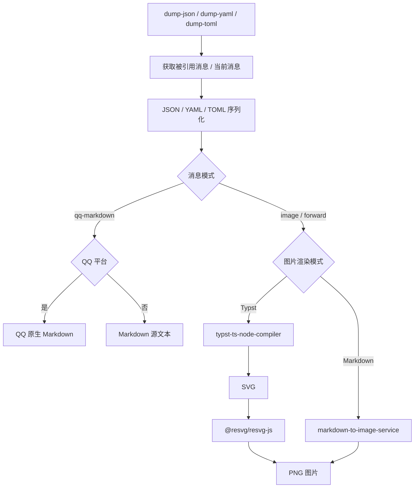
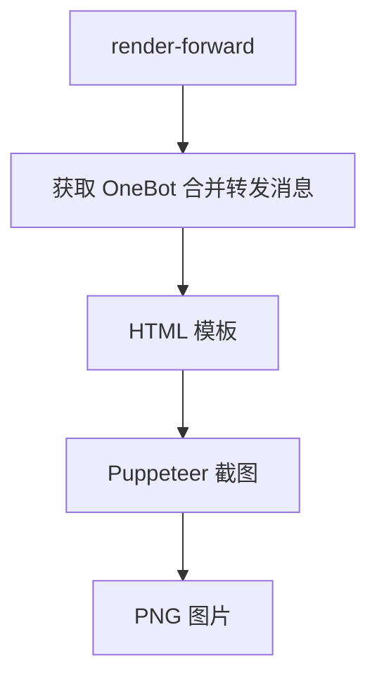
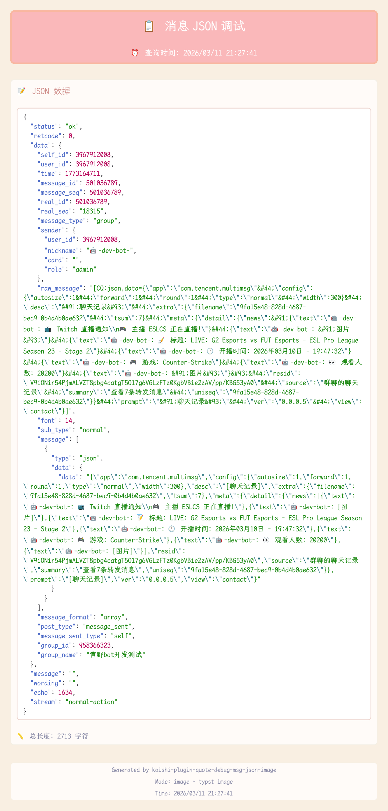
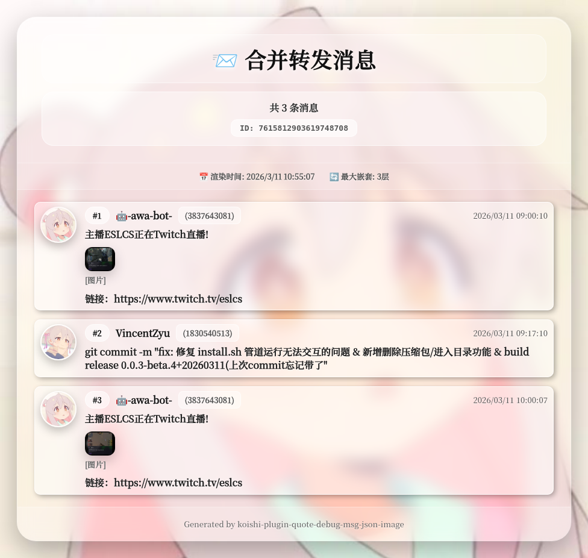
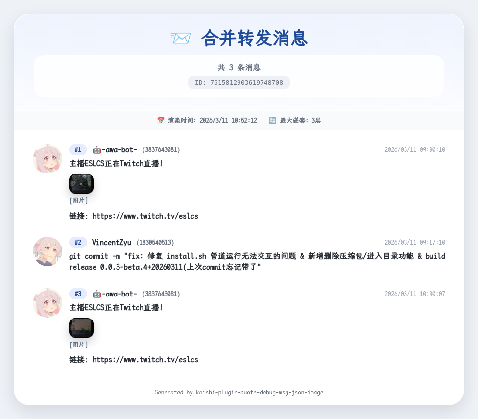

# 📋 koishi-plugin-quote-debug-msg-json-image

[](https://www.npmjs.com/package/koishi-plugin-quote-debug-msg-json-image)
[](https://www.npmjs.com/package/koishi-plugin-quote-debug-msg-json-image)

[](https://github.com/VincentZyuApps/koishi-plugin-quote-debug-msg-json-image)
[](https://gitee.com/vincent-zyu/koishi-plugin-quote-debug-msg-json-image)
[](https://forum.koishi.xyz/t/topic/12379)
[](https://qm.qq.com/q/4vjto4V7Di)

<p><del>💬 插件使用问题 / 🐛 Bug反馈 / 👨‍💻 插件开发交流，欢迎加入QQ群：<b>259248174</b>（这个群G了）</del></p>
<p>💬 插件使用问题 / 🐛 Bug反馈 / 👨‍💻 插件开发交流，欢迎加入QQ群：<b>1085190201</b></p>
<p>💡 在群里直接艾特我，回复得更快。</p>

回复一条消息，将消息对象序列化为 JSON/YAML/TOML。dump 指令支持 Typst / Markdown 两种图片渲染方式，也支持 QQ 原生 Markdown；在其他平台选择 `qq-markdown` 时会发送 Markdown 源文本。另提供 `render-forward` 指令，将 OneBot 合并转发消息渲染成图片。

## ✨ 功能特性

- 📋 **dump 指令**：将消息对象序列化为 JSON/YAML/TOML，并输出为图片、合并转发或 Markdown
- 🤖 **QQ 官方 Bot 引用适配**：解析 QQ 原始事件中的 `msg_idx` / `ref_msg_idx` / `message_reference` / `msg_elements`
- 🎨 **双渲染引擎**：支持 Typst（推荐）和 Markdown
- 💬 **QQ 原生 Markdown**：通过 QQ internal API 发送 fenced code block，其他平台发送同一份 Markdown 源文本
- 🌈 **代码语法高亮**：JSON/YAML/TOML 自动语法着色
- 😀 **彩色 emoji**：Typst 模式使用 `NotoColorEmoji.ttf` 修复 raw JSON/YAML/TOML 中的 emoji 渲染
- 📨 **render-forward 指令**：将 OneBot 合并转发消息渲染成图片
- 🧵 **嵌套转发支持**：递归处理多层嵌套，并支持最大深度限制

## 📦 依赖说明

### Koishi 服务依赖

插件当前声明的可选服务：

```yaml
optional:
  - markdownToImage   # koishi-plugin-markdown-to-image-service
  - puppeteer         # koishi-plugin-puppeteer
```

说明：

- `koishi-plugin-markdown-to-image-service`：可选服务，仅在使用 Markdown 图片渲染模式时需要；`qq-markdown` 不依赖该服务。
- `koishi-plugin-puppeteer`：可选服务，仅在使用 `render-forward` 合并转发截图渲染时需要。
- Typst dump 是核心路径，不依赖 `markdownToImage` 或 `puppeteer` 服务。
- 当前版本 **不再依赖** `koishi-plugin-to-image-service`。
- 当前版本 **不再依赖** `koishi-plugin-w-node`。

### npm 运行时依赖

这些是核心运行时依赖，会随插件安装，不需要作为 Koishi 服务启用：

```json
{
  "@iarna/toml": "^2.2.5",
  "@myriaddreamin/typst-ts-node-compiler": "^0.7.0",
  "@resvg/resvg-js": "^2.6.2",
  "js-yaml": "^4.1.1"
}
```

### 可选功能依赖

这两个插件在 `peerDependenciesMeta` 中标记为 optional，不安装也不影响 Typst dump：

```json
{
  "koishi-plugin-markdown-to-image-service": "^1.3.6",
  "koishi-plugin-puppeteer": "^3.0.0"
}
```

对应功能缺失时的行为：

- 选择 Markdown 图片渲染但未启用 `markdownToImage` 服务时，会提示启用 `koishi-plugin-markdown-to-image-service` 或改用 Typst。
- `qq-markdown` 会直接发送完整 Markdown，不会在发送失败或内容过长时回退为图片。
- `render-forward` 命令会通过 `ctx.inject(['puppeteer'], ...)` 注册；未启用 `puppeteer` 服务时，该命令不会注册。

### 渲染流程

```text
dump-json / dump-yaml / dump-toml
  -> 获取被引用消息 / 当前消息
  -> JSON / YAML / TOML 序列化
  -> qq-markdown:
       QQ -> 原生 Markdown
       其他平台 -> Markdown 源文本
  -> image / forward + Typst 模式:
       typst-ts-node-compiler -> SVG -> @resvg/resvg-js -> PNG
  -> image / forward + Markdown 模式:
       markdown-to-image-service -> 图片
```



```text
render-forward
  -> 获取 OneBot 合并转发消息
  -> HTML 模板
  -> Puppeteer 截图
  -> PNG
```



## 🚀 使用方法

### dump 指令

回复一条消息并发送：

```text
dump-json
dump-yaml
dump-toml
```

可用选项：

- `-r, --reply-mode <typst|markdown>`：选择渲染引擎。
- `-m, --message-mode <forward|image|qq-markdown>`：回复模式。`forward` 仅 `onebot` / `red` / `discord` 平台可用；`qq-markdown` 在 QQ 平台发送原生 Markdown，在其他平台发送 Markdown 源文本。
- `-s, --self`：解析当前消息本身，而不是被引用的消息。

效果预览：



### render-forward 指令

回复一条 OneBot 合并转发消息并发送：

```text
render-forward
```

可用选项：

- `-i, --index <0|1>`：样式选择，`0` = Source Han Serif 毛玻璃风格，`1` = LXGW WenKai 简约风格。

效果预览：

| Source Han Serif 风格 (index=0) | LXGW WenKai 风格 (index=1) |
|:---:|:---:|
|  |  |

## 🤖 QQ 官方 Bot 引用适配

QQ 官方 Bot 平台下，Koishi 不一定会把被引用消息填入 `session.quote`。本插件会额外解析 QQ 原始事件：

- `(session as any).qq.d`
- `message_scene.ext` 中的 `msg_idx` / `ref_msg_idx`
- `message_reference.message_id`
- `msg_elements[0].msg_idx`
- `session.event.message.quote`

插件还会注册一个轻量 middleware，缓存机器人在线期间收到的 QQ 消息索引。dump 指令会优先尝试通过 `bot.internal.getMessage()` 获取原始被引用消息；失败时再 fallback 到 `session.quote`、内存缓存或 `msg_elements[0]`。

`dumpMessageMode=qq-markdown` 在 QQ 群聊/C2C 中直接调用 `bot.internal.sendMessage()` / `sendPrivateMessage()`，发送 `msg_type=2` 与 `markdown.content`。默认不附加 `message_reference`；只有 `enableQuote=true` 且 `qqMarkdownRespectEnableQuote=true` 时，才会优先使用当前事件的 `msg_idx` 或缓存映射构造 `message_reference`，无法解析时再尝试当前 `messageId`。

注意：

- `dumpMessageMode=forward` 仅 `onebot` / `red` / `discord` 平台可用；QQ 官方 Bot 等其他平台会自动回退为 `image`。
- `enableQuote` 会应用于图片和非 QQ Markdown 源文本；QQ 原生 Markdown 还必须开启 `qqMarkdownRespectEnableQuote` 才会附加引用。
- `qqMarkdownRespectEnableQuote` 默认为 `false`。该能力属于实验性兼容选项，开启后部分 QQ 适配器或接口组合可能把 Markdown 当作普通文本显示。
- `dumpMessageMode=qq-markdown` 发送失败或内容过长时只报告错误，不截断、不拆分，也不回退为图片。
- `render-forward` 仍然是 OneBot 合并转发消息专用功能，不是 QQ 官方普通引用消息渲染。

## 🔤 字体与 emoji

默认开启 `downloadFontsFromRelease`。插件会从 Release 下载字体到 Koishi 运行目录的公共字体目录：

```text
ctx.baseDir/data/fonts
```

下载时会校验文件大小和 SHA256，避免把错误页、半截下载文件或损坏文件当字体使用。

默认管理的字体：

| 文件 | 用途 |
|---|---|
| `LXGWWenKaiMono-Medium.ttf` | dump Typst 主字体；render-forward LXGW 风格字体 |
| `SourceHanSerifSC-Medium.otf` | render-forward Source 风格字体；Typst fallback |
| `NotoColorEmoji.ttf` | Typst 彩色 emoji 字体 |
| `LICENSE` | Noto Color Emoji 的 OFL 1.1 许可证文件 |

Release 下载配置：

| 配置项 | 说明 |
|---|---|
| `downloadFontsFromRelease` | 是否从 Release 自动下载字体 |
| `notoEmojiFontReleaseUrl` | `NotoColorEmoji.ttf` 的 Release 下载地址 |
| `lxgwFontReleaseUrl` | `LXGWWenKaiMono-Medium.ttf` 的 Release 下载地址 |
| `sourceHanFontReleaseUrl` | `SourceHanSerifSC-Medium.otf` 的 Release 下载地址 |

字体路径配置：

| 配置项 | 用途 |
|---|---|
| `dumpTypstFontPath` | dump Typst 主字体路径 |
| `renderForwardSourceFontPath` | render-forward Source 风格字体路径 |
| `renderForwardLxgwFontPath` | render-forward LXGW 风格字体路径 |

`NotoColorEmoji.ttf` 不单独暴露本地路径配置，默认使用 `ctx.baseDir/data/fonts/NotoColorEmoji.ttf`。如果关闭自动下载，需要自行把同名文件放到该目录。

## 🔧 技术实现细节

### 语法高亮资源

npm 包内仍会发布 `syntaxes` 目录作为内置种子文件：

```text
node_modules/koishi-plugin-quote-debug-msg-json-image/syntaxes
```

如果是源码开发模式，对应源文件目录是：

```text
external/quote-debug-msg-json-image/syntaxes
```

插件启动时会把这三个 `sublime-syntax` 文件复制到 Koishi 运行目录：

```text
ctx.baseDir/data/assets/quote-debug-msg-json-image/syntaxes
```

默认复制目录由 `dumpSyntaxAssetFolderRelativePath` 控制，默认值是：

```ts
['data', 'assets', 'quote-debug-msg-json-image', 'syntaxes']
```

Typst 编译器的 workspace 会指向 `ctx.baseDir/data/assets/quote-debug-msg-json-image`，符合 Koishi 运行时文件不写入插件包目录的零占用习惯。

### Typst 渲染

插件内置 JSON/YAML/TOML 的 `sublime-syntax` 文件。运行时会先从 npm 包或源码目录的 `syntaxes` 复制到 `ctx.baseDir/data/assets/quote-debug-msg-json-image/syntaxes`，再通过 Typst workspace + Fenced Code Block 触发语法高亮：

````typst
```json
{"key": "value", "count": 42}
```
````

Typst 的 `#raw(variable, lang: "json")` 对变量内容不会触发语法高亮，所以插件会把序列化后的数据直接嵌入 Typst 源码中的 fenced block。

### resvg 兼容性修复

Typst 生成的 SVG 会使用 CSS 变量设置字形颜色，例如：

```css
.outline_glyph path { fill: var(--glyph_fill); }
```

`@resvg/resvg-js` 对这类 CSS 变量支持不完整。插件在 SVG 转 PNG 前会移除相关规则，让颜色从父级 `fill` 继承，避免文字颜色异常。

### Markdown 图片渲染

Markdown 渲染使用 `koishi-plugin-markdown-to-image-service`，通过标准 Markdown fenced code block 实现语法高亮：

````markdown
```json
{"key": "value"}
```
````

### QQ 原生 Markdown 与源文本

选择 `dumpMessageMode=qq-markdown` 时，插件会构造一份不依赖 `markdownToImage` 的 Markdown 文档：

````markdown
> 如果你看到这行变灰色，说明markdown格式生效。

# Quote Message Debug (JSON)

```json
{"key": "value"}
```
````

QQ 群聊/C2C 会通过原生 Markdown payload 发送。其他平台会把同一份内容作为 `h.text()` 源文本发送，避免 dump 中的 `<at>`、`<message>` 等片段被 Koishi 当成消息元素解析。代码围栏长度会根据数据中最长的连续反引号动态增加，避免消息内容提前闭合 fenced code block。

### 合并转发渲染

`render-forward` 使用 Puppeteer 将 HTML 页面截图为图片：

- Source Han Serif 风格：毛玻璃背景，头像作为背景图。
- LXGW WenKai 风格：简洁浅色卡片。
- 支持头像预获取并转为 base64，减少 Puppeteer 加载远程头像失败的概率。
- 支持嵌套合并转发，达到 `maxForwardNestDepth` 后折叠显示。

## ⚙️ 主要配置项

### dump 指令

| 配置项 | 类型 | 默认值 | 说明 |
|---|---|---|---|
| `dumpRenderMode` | `typst` / `markdown` | `typst` | 默认渲染引擎 |
| `dumpTypstFooterText` | `string` | `🧩 Generated by *koishi-plugin-quote-debug-msg-json-image*` | Typst 图片底部署名文本 |
| `dumpMessageMode` | `forward` / `image` / `qq-markdown` | `image` | `qq-markdown` 在 QQ 发送原生 Markdown，在其他平台发送 Markdown 源文本；失败不回退图片 |
| `qqMarkdownRespectEnableQuote` | `boolean` | `false` | QQ 原生 Markdown 是否在 `enableQuote=true` 时附加实验性的 `message_reference` |
| `maxJsonTextLength` | `number` | `2222` | 合并转发模式下预览文本最大长度 |
| `dumpTypstRenderScale` | `number` | `2.33` | Typst 渲染缩放倍率 |
| `dumpTypstPageBgColor` | `string` | `#f9efe2` | Typst 页面背景色 |
| `dumpTypstCodeBlockFillColor` | `string` | `#ffffff` | Typst 代码块背景色 |
| `dumpSyntaxAssetFolderRelativePath` | `string[]` | `['data', 'assets', 'quote-debug-msg-json-image', 'syntaxes']` | 相对于 Koishi 根目录 `ctx.baseDir` 的语法高亮文件夹路径 |
| `dumpJsonSyntaxFilename` | `string` | `json.sublime-syntax.yml` | JSON 语法高亮文件名 |
| `dumpYamlSyntaxFilename` | `string` | `yaml.sublime-syntax.yml` | YAML 语法高亮文件名 |
| `dumpTomlSyntaxFilename` | `string` | `toml.sublime-syntax.yml` | TOML 语法高亮文件名 |

### render-forward

| 配置项 | 类型 | 默认值 | 说明 |
|---|---|---|---|
| `maxForwardNestDepth` | `number` | `3` | 最大嵌套深度 |
| `renderForwardDefaultStyle` | `source` / `lxgw` | `source` | 默认渲染风格 |
| `renderForwardMaxImageSize` | `number` | `50` | 合并转发内图片长边最大显示尺寸 |
| `renderForwardPrefetchAvatar` | `boolean` | `true` | 是否预获取 QQ 头像并转为 base64 |

## 📝 更新日志

详见 [changelog.md](changelog.md)。
